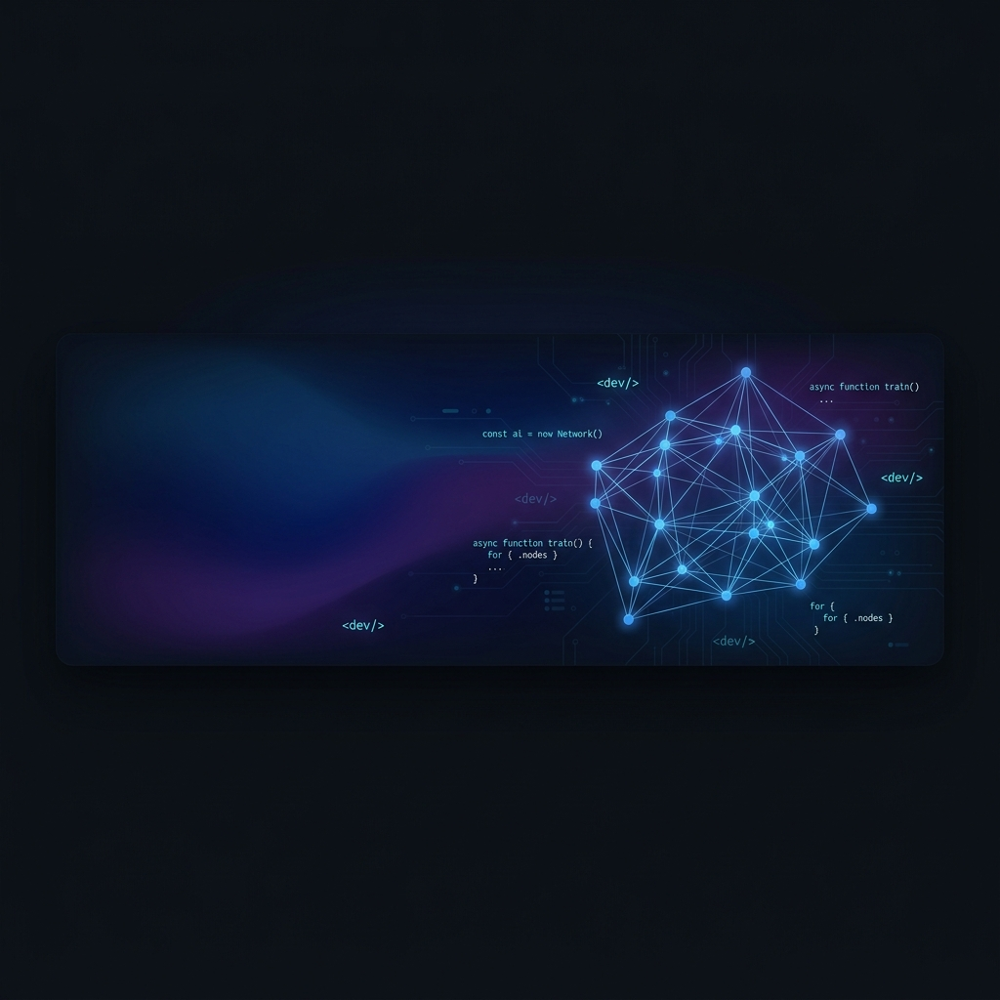

  

  # Hi there, I'm Luca 👋

  

  
  
  

---

I work within R&D and Technical Enablement at [Intesa Sanpaolo](https://group.intesasanpaolo.com/) — bridging the gap between emerging AI technologies (GenAI, LLMs, Agentic AI) and production operations in one of Europe's largest banking groups.

Outside of work, I'm a relentless builder: I compete in hackathons, contribute to open-source AI tooling, and write about the intersection of software architecture and rapidly evolving AI systems. I believe the best AI products are built on solid engineering foundations — **AI should be the cherry on top, not the whole cake.**

---

## 🤝 Open Source Contributions

### [Google ADK](https://github.com/google/adk-python)
- [**Feat/OpenAI responses api 3209** (adk-python #6188)](https://github.com/google/adk-python/pull/6188) — Added native support for the OpenAI responses API; co-authored and merged in commit [`6b831d5`](https://github.com/google/adk-python/commit/6b831d5aa0e39b75f69df87746f073bfd66a60a0).

### [Docling (IBM)](https://github.com/DS4SD/docling)
- [**feat: capture picture description API usage** (docling #3632)](https://github.com/docling-project/docling/pull/3632) — Integrated API token usage tracking/telemetry for multimodal image models.

### [Agent Skills (Addy Osmani)](https://github.com/nicepkg/agent-skills)
- [**Feat: Implement peeking bear animation on password show/hide** (tunnel-bear-login #5)](https://github.com/addyosmani/tunnel-bear-login/pull/5) — Implemented the signature interactive password peeking micro-animations on the login benchmark UI.

---

## 🏆 Hackathons & Awards

<table>
  <tr>
    <td>🥇</td>
    <td>
      <strong>1st Place — "Build the Future of Personal AI" Hackathon</strong> <em>(OGR Torino, 2025)</em> 
      Built <a href="https://github.com/FrigaZzz/care-talk-buddy-oss"><strong>Cara</strong></a> — a digital companion for elderly medication management that replaces cold alarms with phone calls using a loved one's cloned voice. Instead of a buzzing timer, the phone rings: <em>"Hi Grandma, it's time for your heart pill."</em> 
      Tech: Google Gemini · ElevenLabs · Next.js · React Native
    </td>
  </tr>
  <tr>
    <td>🥉</td>
    <td>
      <strong>3rd Place & Arduino Prize — Tiny Hack Edge AI Hackathon</strong> <em>(2025)</em> 
      Built <a href="https://github.com/FrigaZzz/mood-sip"><strong>MoodSip</strong></a> — a smart hydration system using Arduino Nicla Vision for edge-based human detection and cloud-based emotion recognition. When stress is detected, the system adjusts hydration reminders in real-time. 
      Tech: Arduino Nicla Vision · Focoos · React/TypeScript · Web Bluetooth API · with <a href="https://github.com/pitdagosti">@pitdagosti</a> & <a href="https://github.com/davmacario">@davmacario</a>
    </td>
  </tr>
</table>

---

## 🔬 Open Source & Side Projects

<table>
  <tr>
    <td width="50%">
      <h3><a href="https://github.com/FrigaZzz/bbox-tester">📦 bbox-tester</a></h3>
      
Python CLI benchmark for GUI-agent visual grounding. Sends screenshots to multimodal models, scores predicted bounding boxes against gold references, and generates interactive reports. Featured in my post on the "Tiny Pixel" problem killing browser agents.

    </td>
    <td width="50%">
      <h3><a href="https://github.com/FrigaZzz/care-talk-buddy-oss">💙 care-talk-buddy-oss</a> · <a href="https://github.com/FrigaZzz/cara-audio">cara-audio</a></h3>
      
Open-source Cara platform: an AI companion for elderly care. <code>cara-audio</code> is the GPU-accelerated audio microservice with real-time streaming TTS (Chatterbox) and ultra-fast STT (Whisper).

    </td>
  </tr>
  <tr>
    <td width="50%">
      <h3><a href="https://github.com/FrigaZzz/safe-deepseek">🔒 safe-deepseek</a> ⭐ 3</h3>
      
A Go-based safety layer for DeepSeek model deployments in air-gapped environments.

    </td>
    <td width="50%">
      <h3><a href="https://github.com/FrigaZzz/functional-data-regression-mip">📐 functional-data-regression-mip</a></h3>
      
Novel scalar-on-function linear regression using Mixed Integer Programming (MIP) solvers. Research from my internship at Université Laval, Québec.

    </td>
  </tr>
  <tr>
    <td width="50%">
      <h3><a href="https://github.com/FrigaZzz/contrastive-generation">🧪 contrastive-generation</a></h3>
      
Clean implementation of contrastive decoding for language models — improving generation quality by contrasting strong and weak model outputs.

    </td>
    <td width="50%">
    </td>
  </tr>
</table>

---

## ✍️ Featured Writing

I regularly write about AI architecture and engineering on [Medium](https://medium.com/@frigato.luca97). Here are some highlights:

| | Article | Topic |
|---|---|---|
| 🔐 | [**Running DeepSeek-R1 Locally and Securely: A Complete Air-Gapped Setup Guide**](https://medium.com/@frigato.luca97) | Deploying LLMs in fully offline environments for privacy & security |
| 🔧 | [**Managing SSL Certificates in VS Code: Corporate AI Integration Made Simple**](https://medium.com/@frigato.luca97) | Solving SSL hell in corporate dev environments without disabling security |
| 🎯 | [**The "Pixel Tiny" Problem Killing Your AI Browser Agent**](https://medium.com/@frigato.luca97) | Why visual grounding — not reasoning — is the bottleneck for browser agents |

---

## 💻 What I Work With

**Languages**

**AI / ML**

**Backend**

**Frontend**

**Cloud & Infra**

**Data**

**DevOps**

**Interests:** Agentic AI · LLM orchestration · Browser agents · Edge AI · AI architecture · Web p